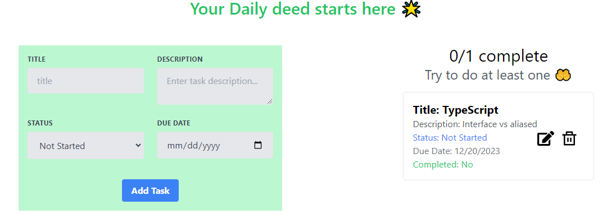

# Task Manager


## Live site: https://task-manager-hub.netlify.app/
### Features
- CRUD operations for tasks (Create, Read, Update, Delete).
- Loading state indication during data fetching and processing.
- Display a message encouraging users to start their daily deeds when no tasks are available.
- Error handling for task-related operations.
### Technologies and Packages
**Technologies**
- Tailwind CSS
- React JS
- NodeJs
- ExpressJs
- MongoDB

**Packages**
- axios
- react-icon
- react-hot-toast

### Code Link
Client side: https://github.com/Al-Amin49/task-manager-client.git
Server side: https://github.com/Al-Amin49/task-manager-server.git

### Installation and Usage
1. Clone the repository
```bash
git clone https://github.com/Al-Amin49/task-manager-client.git

```
2. Install Dependencies
```bash
cd task-manager-client
npm install

```
3. Run the server
```
npm run dev
```


